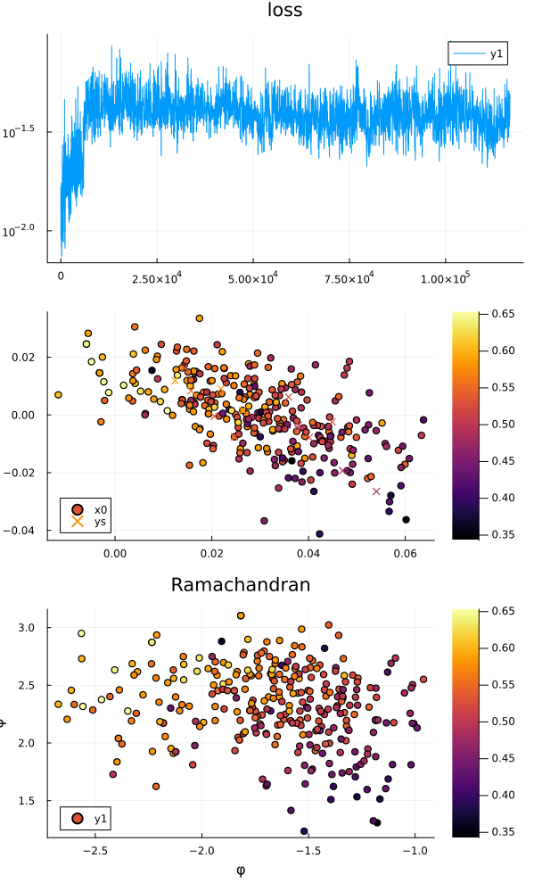

# ISOKANN

This should be the reference implementation for ISOKANN.
Currently things are still fluctuating, so we have different implementations

- isokann.jl - full fledged ISOKANN with adaptive sampling and optimal control
- isomolly.jl - basic ISOKANN with adaptive sampling for proteins
- scripts/molly.jl - reimplementation of the above, working on given data

The most recent plot:
